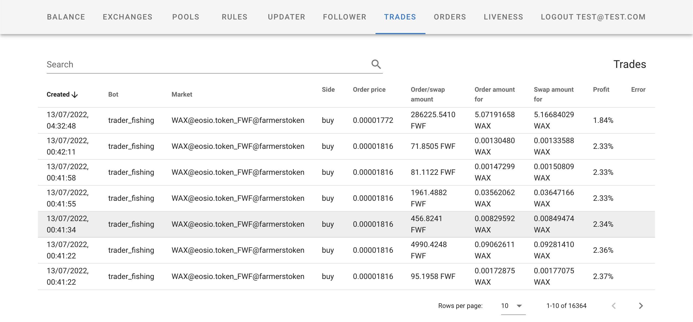

# WAX/Alcor Arbitrage bot



Alcor/WAX orderbook-vs-dex arbitrageing bot: simple and fishing.

Prerequisites:
 * Firebase
 * WAX node

Moving parts:
 * Admin web interface (VUE)
 * Pool watcher/Orderbook watcher
 * Blockchain listener
 * Trading bot 

## Project setup
```
yarn install
```

### Compiles and hot-reloads for development
```
yarn serve
```

### Compiles and minifies for production
```
yarn build
```

### Lints and fixes files
```
yarn lint
```

### Customize configuration
See [Configuration Reference](https://cli.vuejs.org/config/).

## Docker
```
docker build -t alcorarb .
docker run --name alcorarb_updater --rm -i -t alcorarb:latest npm run updater
docker run --name alcorarb_trader --rm -i -t alcorarb:latest npm run trader
```

## Realtime database rules
```
{
  "rules": {
      ".read": "auth.uid != null && auth.provider == 'google' && auth.token.email.endsWith('@mydomain.tld')"
      ".write": "auth.uid != null && auth.provider == 'google' && auth.token.email.endsWith('@mydomain.tld')",
  }
}

{
  "rules": {
    ".read": "auth.email == 'test@test.com'",
    ".write": "auth.email == 'test@test.com'",
    "queue": {
      ".indexOn": "_state"
    }
  }
}
```

## No docker setup
```
while true; do timeout 600s npm run follower; done
while true; do timeout 60s npm run updater; done
while true; do timeout 600s npm run trader_fishing; done
```
